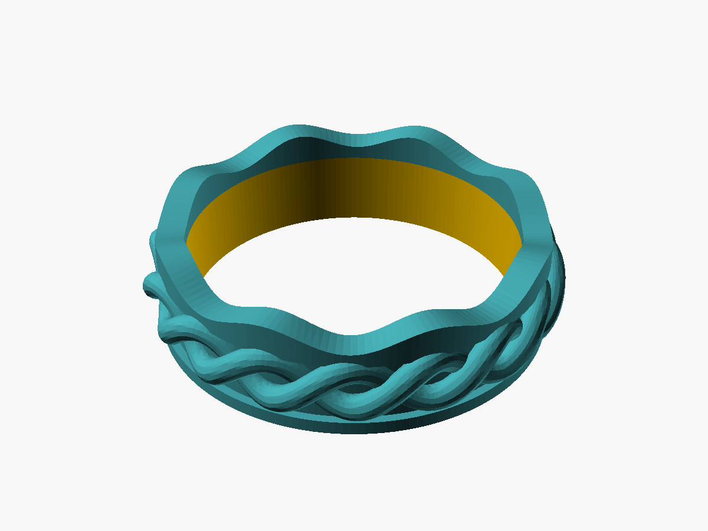

# Celtic weave ring

Source: `scad/celtic_ring/celtic_ring.scad` · Export: `exports/celtic_ring.stl`

| Parameter      | Value                          |
|----------------|--------------------------------|
| Size           | UK I (15.49 mm) + 0.3 mm clearance = 15.8 mm bore |
| Outer diameter | ~21 mm at the crossings        |
| Band width     | 6 mm                           |
| Volume         | ~0.6 cm³ (well under 1 g)      |

## Suggested print settings (P2S)

- Orientation: as exported, flat on the plate (bore vertical). No supports.
- Layer height: 0.12 mm ("Fine") for a smooth weave; 0.16 mm is fine too.
- Walls: 3, infill irrelevant at this size.
- Filament: any PLA/PETG. Slows down a lot on small layers, so let the
  slicer's minimum layer time handle cooling, or print 2–3 rings at once.

## Fit check

Wear-test after printing. If tight, raise `clearance` in the .scad by 0.1 mm
and re-export; if loose, lower it. Whole UK sizes step by ~0.4 mm in diameter.

## Variants

### Size S with a wavy top edge

`scad/celtic_ring/celtic_ring_S_wavy.scad` → `exports/celtic_ring_S_wavy.stl`.
A three-line wrapper that includes the main file and overrides `ring_size_mm`
(UK S, 19.56 mm → 19.86 mm bore) and `wavy_top`. The top rim rises and falls
once per braid crossing (`wave_n`), 1.1 mm peak to trough (`wave_amp`), with
crests over the peaks of the first strand. The bottom edge stays flat so it
prints as before, no supports. Height 6.55 mm, outer diameter 25.1 mm.
Any size can be made the same way: copy the wrapper and change the number.
