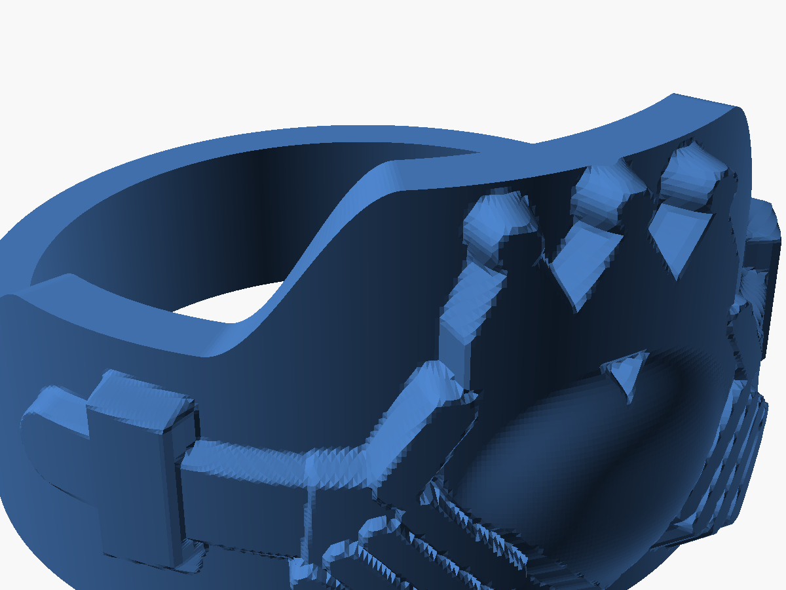
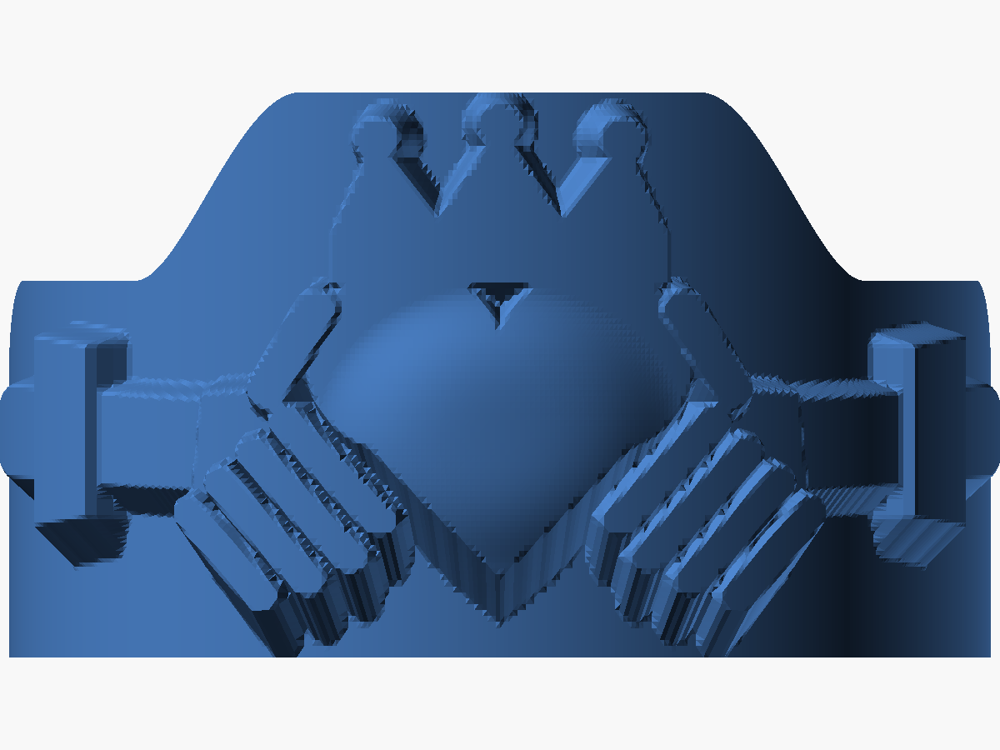

# Claddagh ring

Source: `scad/claddagh_ring/claddagh_ring.scad` · Export: `exports/claddagh_ring.stl`

Two hands holding a crowned heart. Unlike the Celtic ring, this one is built
as a single generated polyhedron: the motif is a height-map in unwrapped band
coordinates (arc length × width) made from signed-distance primitives, then
wrapped onto the cylinder. Everything is parametric; positions of the hands,
heart and crown are plain coordinates near the top of the file.

| Parameter        | Value                                             |
|------------------|---------------------------------------------------|
| Size             | UK N (17.53 mm) + 0.3 mm clearance = 17.83 mm bore |
| Band             | 12 mm wide at the top, 8 mm at the hands, 5 mm at the back, 1.5 mm thick |
| Relief           | 0.7–1.7 mm above the band                         |
| Volume           | ~0.75 cm³                                         |

## Printability choices

- **Flat bottom edge.** The band's bottom edge is flat all the way round and
  all the width change is on the top edge (`flat_bottom = true`). A symmetric
  band would leave the narrow back floating above the plate. This gives a
  large footprint, so no brim or supports are needed.
- **Underside pass.** Every raised feature's underside is sloped to ~49°
  (`drip_slope`), while top edges stay crisp. The mesh has no faces
  overhanging more than 50° from vertical.
- Fingers run diagonally along the heart's edges so they need almost no
  underside fill and stay distinct.

## Suggested print settings (P2S)

- Orientation: as exported, flat on the plate, crown up. No supports, no brim.
- Layer height: 0.12 mm. The relief detail is ~0.3 mm wide at its finest.
- Walls: 3. Enable "Slow down for overhangs" (default on).
- PLA or PETG. A silk or metallic PLA looks good for jewellery.

## Tuning

- Fit: change `clearance` as with the Celtic ring.
- Want the classic symmetric band? Set `flat_bottom = false` and slice with
  tree supports (auto) and a brim.
- Regenerating takes ~20 s at the default 720×96 grid.
