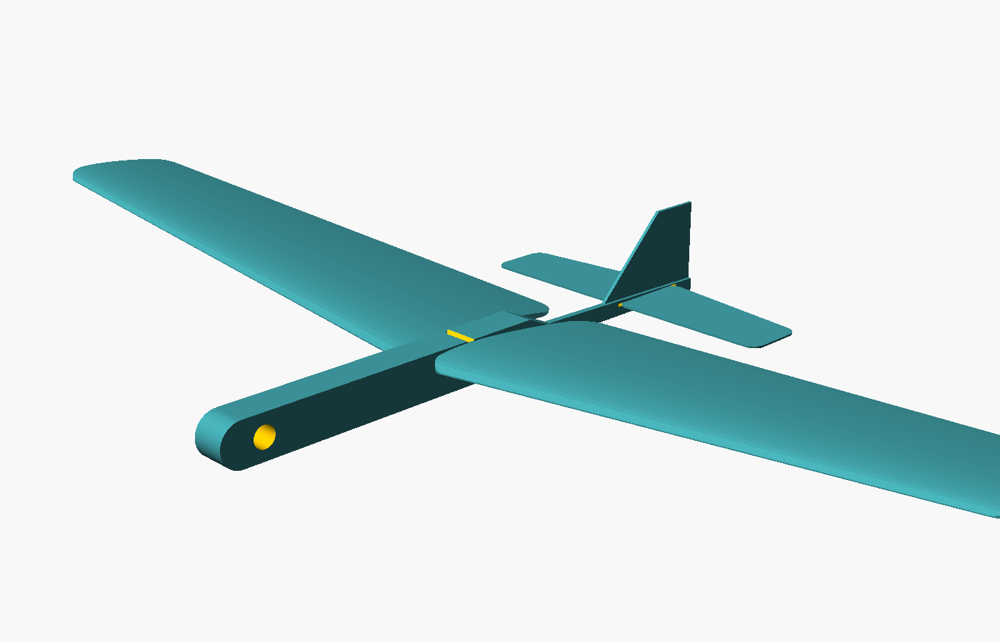
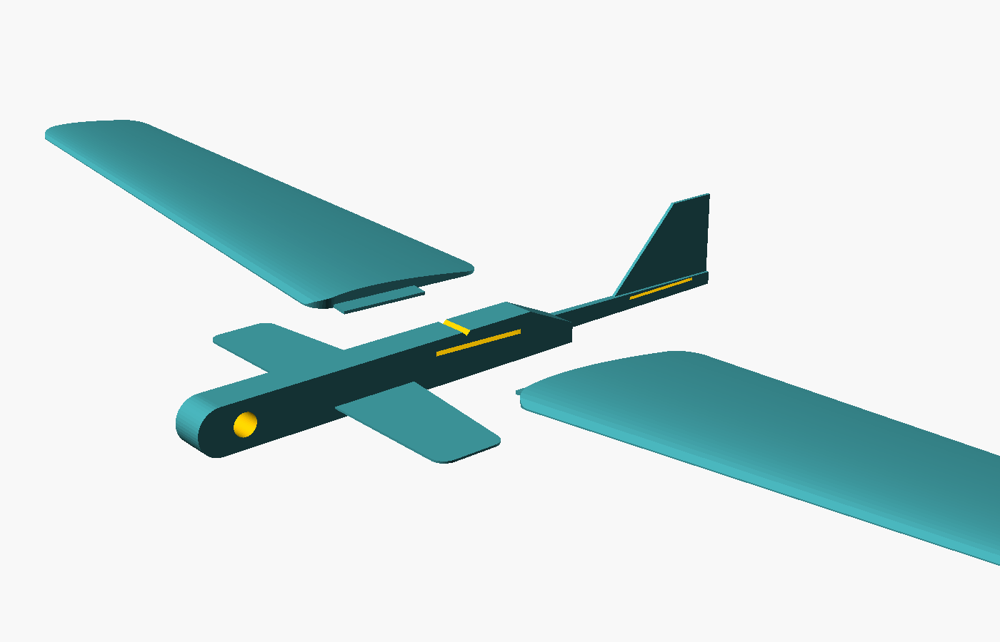
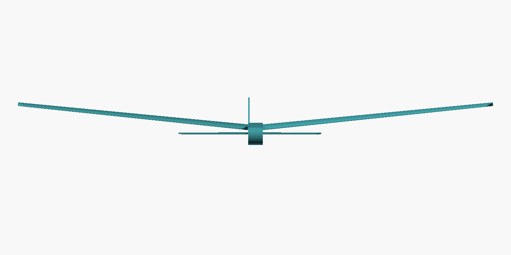

# Tiny chuck glider



Source: `scad/glider/glider.scad` · Exports: `exports/glider_fuselage.stl` and
`exports/glider_plate_wings.stl` (wings + tailplane) are the two prints;
`glider_plate.stl` has everything on one plate, and each part is also
exported on its own.

| Spec               | Value                                   |
|--------------------|-----------------------------------------|
| Wingspan           | 268 mm (2 × 130 mm halves + fuselage)    |
| Length             | 142 mm                                   |
| Wing area          | ~104 cm², mean chord 40 mm               |
| Wing section       | flat-bottomed, NACA-style top, 6% thick (max at 30% chord) |
| Mass (as sliced)   | ~20 g → wing loading ~0.19 g/cm²         |
| Dihedral           | 6° per side                              |
| Wing incidence     | +2° relative to the tailplane            |
| Design CG          | 32% of mean chord, marked by the notch on top of the fuselage |


**Version 3: cambered wing.** V1 (59 cm² flat wedge wing, 17 g, 0.29 g/cm²)
flew like a dart. V2 (flat 0.45 mm skin with spars, 94 cm²) was never printed.
V3 replaces the flat plate with a proper cambered section: flat bottom so it
prints flat, all the camber in the curved top surface, which the slicer's
sparse infill supports. The box section is far stiffer than a plate, so the
spars are gone. A cambered section lifts about twice as hard as a flat plate
at the same speed, so despite weighing a little more than V2 it should glide
much slower and flatter.

## How it goes together




Four parts, push-fit, no glue needed (a dot of CA on the tabs is optional).
Fuselage upright: fin up, flat edge down, round end forward.

1. Slide the tailplane through the slot in the boom and centre it on the boom.
2. Wing halves. Each is an airfoil: flat on one face, curved on the other,
   thickest about a third of the way back from the rounded edge. Orientation:
   - **curved face up**, flat face down;
   - **thick, rounded edge forward** (leading edge); the thin edge is the
     trailing edge;
   - the tab is 5 mm behind the leading edge. It only fits the slot one way
     lengthwise;
   - push it in until the root touches the fuselage. Tips should angle **up**
     (6° each side, see the front view). If the tips angle down, the wing is
     upside down.
   The slots are cut at 6° dihedral and 2° incidence, so the angles come from
   the fuselage. The wing's leading edge ends up 4 mm ahead of the slot.
3. Balance it on two fingertips under the wings: it should balance at the
   notch, ~12 mm behind the wing's leading edge. Slightly nose-heavy is fine,
   tail-heavy is not.

Expected masses and balance point (from the model and the slicer settings above):

| Part         | Mass  | Balance point, from the nose            |
|--------------|-------|-----------------------------------------|
| Fuselage     | 9.0 g |                                         |
| Wing half    | ~5 g  | (per side, at 10% infill / 2+2 skins)   |
| Tailplane    | 0.8 g |                                         |
| **Complete** | ~20 g | **62 mm, at the notch**                  |

## Print settings (P2S)

Two prints, because the fuselage and the wings want different infill. (You can
do it as one plate with per-object settings instead: right-click an object →
Add settings → Sparse infill density.)

**Print 1: `glider_fuselage.stl`**
- 0.15 mm layers, 2 walls, **100% infill**. The balance calculation assumes
  a solid nose; sparse infill there makes it tail-heavy.
- It prints lying on its side, as exported (fin flat on the plate), so the
  slot widths are in-plane and come out to size. The boom and fin are flush
  with the bed-side face, so the tail sits ~3.5 mm to one side of the wing
  centre line. That's intentional and harmless.

**Print 2: `glider_plate_wings.stl`** (both wings and the tailplane)
- 0.15 mm layers, 2 walls, **10% gyroid infill**, **2 top and 2 bottom
  layers**. The curved top skin is printed over the sparse infill like the top
  of any normal part. The balance estimate assumes these numbers: 100% infill
  here would add ~13 g and ruin it.
- A 3 mm brim on the wings is cheap insurance against corners lifting.
- Balance was estimated by `scripts/glider_cg.py`, which models the wing as
  skins + walls + 10% infill rather than solid PLA.
- 2 walls. Brim optional for the fuselage; the pod's footprint is fine on PEI.
- Slots have 0.25 mm clearance over the tab/plate. If one is still tight,
  a couple of passes with a craft knife or a needle file opens it up.
- PLA. Avoid heavy, brittle "silk" PLA for the wings.

## Trimming

- **Dives**: too nose-heavy, or the tail is set nose-down. Bend nothing; check
  the tailplane is fully seated and level. Move the CG back only if it balances
  well ahead of the notch.
- **Stalls / porpoises**: tail-heavy. Add ballast to the nose pocket: a short
  M3 screw, airsoft BBs, or blu-tack, until it balances at the notch.
- **Turns hard one way**: a warped wing half. Reprint, or warm the wing gently
  and flatten.
- Launch: hold the pod under the wing, throw gently level, slightly nose-down.
  With the lower wing loading it wants a gentle push, not a hard throw.
- The dihedral is held by the tab fit. Once both tips sit at the same height,
  a drop of PVA or CA at each root locks it.

## Tuning the model

All the numbers are at the top of the .scad. `part = "assembled"` renders the
whole aircraft; the OpenSCAD console echoes the target CG position. Mass and
CG of any variant can be checked with trimesh:

```
openscad -D 'part="assembled"' -o /tmp/g.stl scad/glider/glider.scad
.venv/bin/python -c "import trimesh; m=trimesh.load('/tmp/g.stl'); print(m.volume/1000*1.24, m.center_mass)"
```
